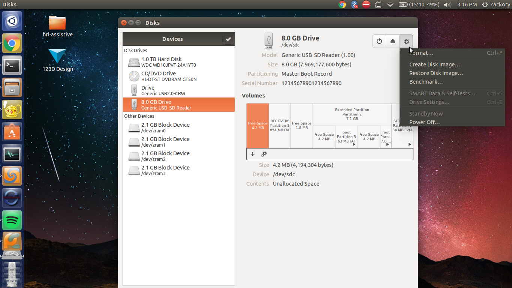
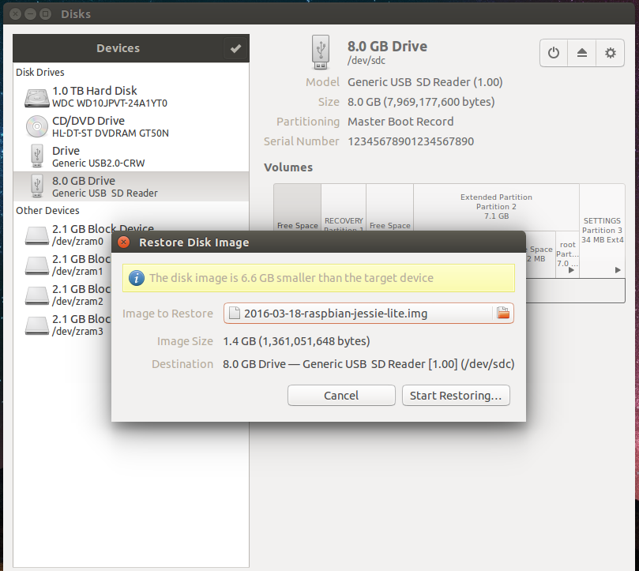
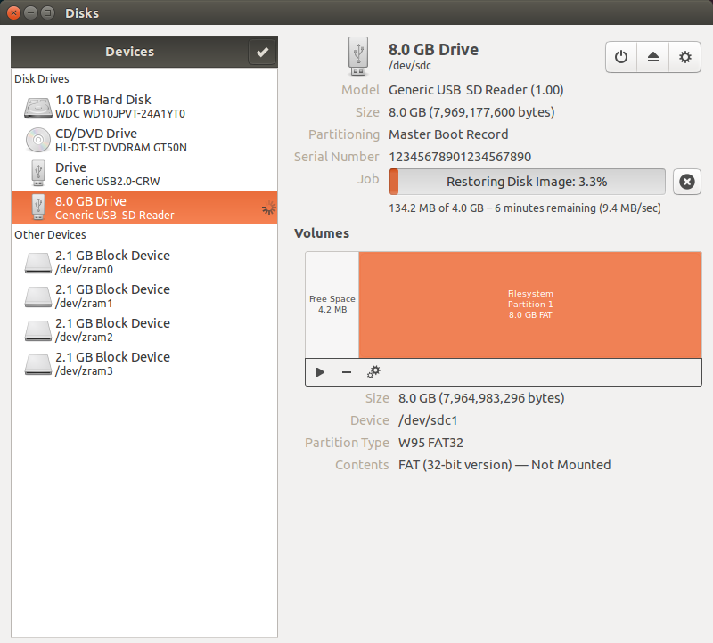

# Proto-Bots
Modular and interactive cardboard prototyping robots.


## Setting Up Raspbian on Raspberry Pi
Note: You can use the instructions provided [here](https://www.raspberrypi.org/documentation/installation/installing-images/README.md)
or you can use the instructions provided below if you are using Ubuntu.

Install Raspbian from [here](https://www.raspberrypi.org/downloads/raspbian/) (the full version, not Lite version, otherwise ssh won't be setup for us).  
Inside the zip file should be a single `.img` file. Unzip the zip file.  
Plug in your Raspberry Pi's micro SD card into your computer.  
Run the program 'Disks' and locate the micro SD card.  
Click the 'gear' on the top right and then click 'Restore Disk Image'  
  
Navigate to the `.img` file that we downloaded, then click 'Start Restoring...'.  
  
Restoring the image should look similar to this:  
  
Congratulations, Raspbian is now setup on your Raspberry Pi.


## Setting Up Networking on Raspberry Pi
We will be creating a headless Raspberry Pi (no ethernet cable needed)!  
In /etc/network/interface:  
```bash
auto lo
iface lo inet loopback

iface eth0 inet dhcp

allow-hotplug wlan0
iface wlan0 inet manual
wpa-roam /etc/wpa_supplicant/wpa_supplicant.conf
```

In /etc/wpa_supplicant/wpa_supplicant.conf:  
```
ctrl_interface=DIR=/var/run/wpa_supplicant GROUP=netdev
update_config=1
network={
        ssid="My Network"
        psk="Password"
        proto=RSN
        key_mgmt=WPA-PSK
        pairwise=CCMP
        auth_alg=OPEN
        scan_ssid=1
}
```

In /etc/hostname:  
```
robotpi
```

In /etc/hosts, last line should be:  
```
127.0.1.1	robotpi
```


## Wiring your robot
Attach the robot's left eye PWM to port 17 and right eye PWM to port 18 using pinout [here](https://www.raspberrypi.org/documentation/usage/gpio-plus-and-raspi2/).


## Connecting to Your Raspberry Pi
Find the local IP address of your raspberry pi (most likely looks something like `192.168.x.x`).  
Run `ssh pi@192.168.x.x` and use 'raspberry' for a password.


## Get Your Robot Moving!
Once you are connected to your Raspberry Pi through ssh we need to update the software.  
First, let's expand the main partition. Do so by typing `sudo raspi-config` and choosing the 'Expand Filesystem' option.  
Next, run `sudo apt-get update` followed by `sudo apt-get upgrade`. Lastly, reboot your Pi `sudo reboot`.  
Now let's clone the git repository using the command `git clone https://github.com/Zackory/Proto-Bots`.  
Then navigate into the cloned repository `cd Proto-Bots/`.  
Next we need to install 'pigpio' for controlling the servos through python.  
You can install pigpio using the official instructions [here](http://abyz.co.uk/rpi/pigpio/download.html).
or by using the terminal commands copied below for convenience.  
'''
rm pigpio.zip
sudo rm -rf PIGPIO
wget abyz.co.uk/rpi/pigpio/pigpio.zip
unzip pigpio.zip
cd PIGPIO
make -j4
sudo make install
```
### Need to run `sudo pigpiod` on startup?
Next we need to install 'pygame' so that we can access joystick controllers using python.
To install pygame you can use `sudo apt-get install pygame`.  
