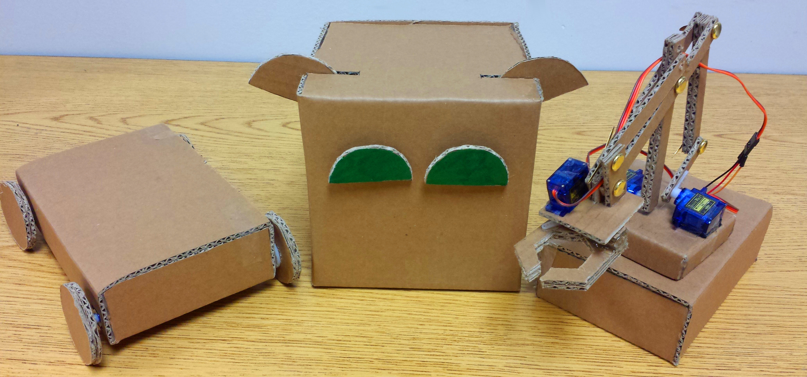

# Pypr Robots
Social robots for human-robot interaction education.  

  

Want to view the 3D models or cardboard cutout instructions for the robots? Checkout the `Models-Instructions` directory.  
The rest of this file provides programming setup and wiring instructions for the robots!  


## Setting Up Raspbian on Raspberry Pi
**Note:** You can use the instructions provided [here](https://www.raspberrypi.org/documentation/installation/installing-images/README.md)
or you can use the instructions provided below if you are using Ubuntu.

Install Raspbian from [here](https://www.raspberrypi.org/downloads/raspbian/) (the full version, not Lite version, otherwise ssh won't be setup for us).  
Inside the zip file should be a single `.img` file. Unzip the zip file.  
Plug in your Raspberry Pi's micro SD card into your computer.  
Run the program 'Disks' and locate the micro SD card.  
Click the 'gear' on the top right and then click 'Restore Disk Image'  
  
Navigate to the `.img` file that we downloaded, then click 'Start Restoring...'.  
  
Restoring the image should look similar to this:  
  
Congratulations, Raspbian is now setup on your Raspberry Pi.


## Setting Up Networking on Raspberry Pi
We will be creating a headless Raspberry Pi (no ethernet cable needed)! To do so, you should connect a USB Wi-Fi adapter to your Raspberry Pi. Below is a list of files that can be found in our newly created Raspbian OS which need to be updated. **NOTE: If you are using Linux, make sure you are updating the Raspbian version of these files which exist on the SD card and not the versions which exist on your personal Linux machine.**  
In /etc/network/interface:  
```bash
auto lo
iface lo inet loopback

iface eth0 inet dhcp

allow-hotplug wlan0
iface wlan0 inet manual
wpa-roam /etc/wpa_supplicant/wpa_supplicant.conf
```

In /etc/wpa_supplicant/wpa_supplicant.conf:  
```
ctrl_interface=DIR=/var/run/wpa_supplicant GROUP=netdev
update_config=1
network={
        ssid="My Network"
        psk="Password"
        proto=RSN
        key_mgmt=WPA-PSK
        pairwise=CCMP
        auth_alg=OPEN
        scan_ssid=1
}
```

In /etc/hostname:  
```
robotpi
```

In /etc/hosts, last line should be:  
```
127.0.1.1	robotpi
```


## Wiring your robot
A GPIO pinout for the Raspberry Pi can be found [here](https://www.raspberrypi.org/documentation/usage/gpio-plus-and-raspi2/) and is also displayed below for convenience. The pinout provides a graphical display for the numbering of each pin on the Raspberry Pi.  
  

#### Humanoid Robot
Attach the robot's left eye servo signal PWM cable (likely the orange or white cable) to port 17 and right eye PWM cable to port 18 using the pinout above. Additionally, connect the left and right ears to ports 22 and 23, respectively.  
If your servos are spinning in the opposite direction when tested, try flipping the `invert` variable to `True` within `robot-humanoid/humanoid.py`.

#### Courier Robot
Attach the back left and back right servos to PWM ports 17 and 18 respectively. Additionally, attach the front left servo to port 22 and the front right servo to port 23.

#### Robotic Arm
Attach the base servo (beneath the rotating base platform) to PWM port 17 on the Raspberry Pi. The gripper servo can be attached to port 18. The arm servo (mounted on the right side of the rotating platform when facing the robotic arm) may be connected to port 22, whereas the forearm servo (mounted on the left side of the platform) should be connected to port 23.


## Connecting to Your Raspberry Pi
If you have not already done so, boot up your Raspberry Pi by connecting the USB power cable. Find the local IP address of your raspberry pi through your WiFi Router (most likely looks something like `192.168.x.x`).  
If you are unable to find your Raspberry Pi's local IP address, then you can set the Raspberry Pi to have a fixed IP address (tutorials of how to do this can be found online).  
Run `ssh pi@192.168.x.x` and use 'raspberry' for a password.


## Get Your Robot Moving!
Once you are connected to your Raspberry Pi through ssh we need to update the software.  
First, let's expand the main partition. Do so by typing `sudo raspi-config` and choosing the 'Expand Filesystem' option.  
Now let's clone the git repository using the command `git clone https://github.com/Zackory/Pypr-Robots.git`.  
At this point you can automate the entire setup process by running `./setup.sh`.  
Once the setup process is complete, you may connect a USB joystick to the Raspberry Pi and run `sudo python ~/Pypr-Robots/robot-humanoid/humanoid.py` to launch the joystick controller for the humanoid robot.  
Additionally, the commands `sudo python ~/Pypr-Robots/robot-arm/arm.py` and `sudo python ~/Pypr-Robots/robot-courier/courier.py` can be run to launch the controllers for the robotic arm and courier robot respectively.  


## 
